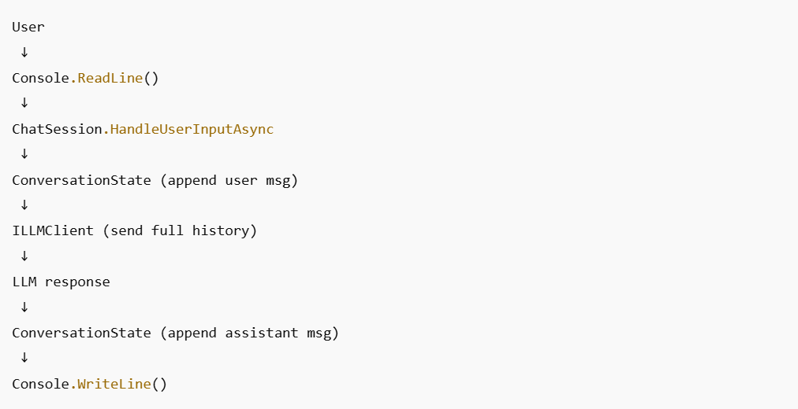

# C# Console App
* Console app built with C# for the sake of learning. 
* Current objective is to build a Mininal "LLM-Shell" application.
* The goal is to evovle this into an AI agent desktop app.

a minimal data-flow diagram 

# Resources
1.  https://learn.microsoft.com/en-us/dotnet/csharp/tour-of-csharp/tutorials/
2.  https://platform.openai.com/docs/api-reference/authentication?utm_source=chatgpt.com
